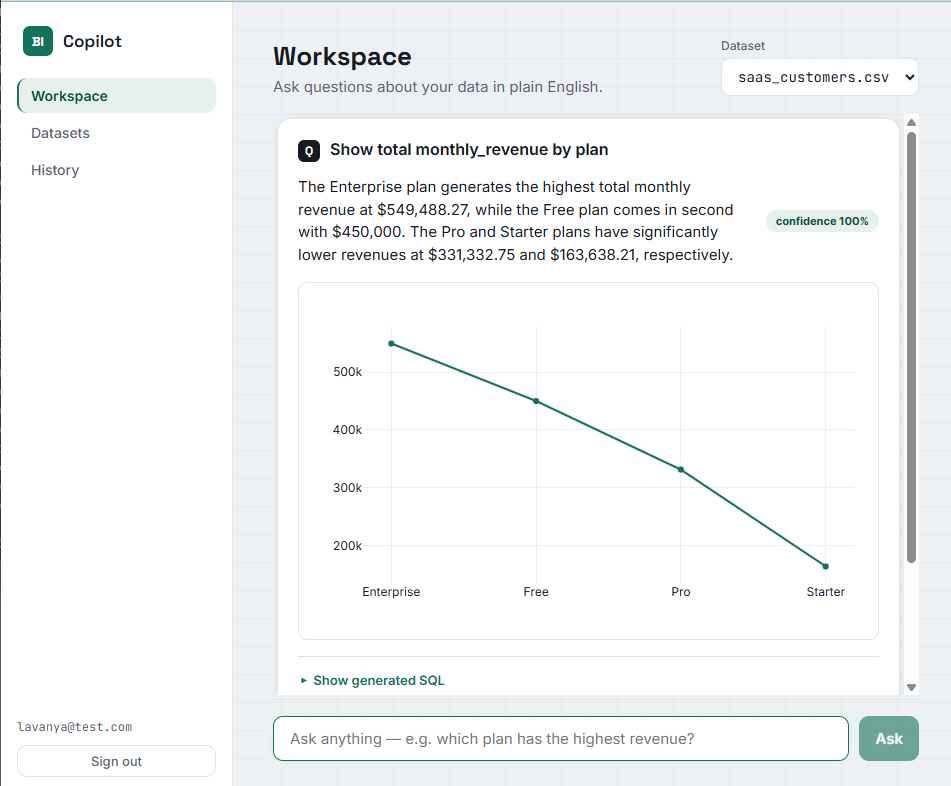

# AI-Powered Business Intelligence Copilot

Ask questions about your own data in plain English and get back a chart, a written
insight, and the exact SQL that produced it — with an AST-based safety engine that
refuses anything but a read-only query, and a hybrid-RAG cache that recognises when
a new question means the same as an earlier one.

Built end to end on a **100% free / open-source stack.**

**🔗 Live demo:** https://bi-copilot-wgu0.onrender.com
**Demo login:** `lavanya@test.com` / `MyPassword123`

> Note: the demo runs on a free tier that sleeps when idle, so the first load may
> take 30–60 seconds to wake up. After that it's responsive.

<!-- Add screenshots here (see the "Adding screenshots" note at the bottom):


-->

---

## What it does

Upload a CSV or Excel file. The app reads its structure automatically, then lets you
ask questions like *"which plan earns the most revenue?"* and answers them safely.

- **Natural language to SQL.** An LLM writes the query; you never touch SQL.
- **A safety engine** parses every generated query into an abstract syntax tree and
  allows only a single read-only `SELECT` against that dataset's own columns. Writes,
  DROPs, stacked queries, cross-table access and hallucinated columns are all blocked.
- **Smart charts + AI insights.** Results are turned into the right chart type
  automatically, with a plain-English takeaway and a confidence signal.
- **Hybrid-RAG semantic cache.** Paraphrased questions reuse already-validated SQL
  instead of calling the LLM again.
- **Analytics.** Anomaly detection and forecasting, no LLM required.

---

## Key features

| Area | What's built |
|------|--------------|
| **Auth** | JWT register/login, bcrypt password hashing, protected routes, per-user data isolation (BOLA/IDOR checks) |
| **Data ingestion** | CSV/Excel upload, automatic column profiling (dimension / measure / datetime / id), KPI detection, per-dataset isolated schema |
| **Text-to-SQL** | LLM-generated SQL with a strict schema-grounded prompt |
| **Safety engine** | AST-based validation (single read-only SELECT, own columns only), read-only transaction execution, auto-injected row limit -- **14/14 attack tests passing** |
| **Visualisation** | Rule-based chart selection (bar / line / pie / scatter / table) + Plotly rendering |
| **AI insights** | Plain-English insight, confidence signal, and suggested follow-up questions |
| **Hybrid RAG** | pgvector dense search + Postgres full-text search fused with Reciprocal Rank Fusion, gated on cosine similarity |
| **Analytics** | Anomaly detection (z-score / IsolationForest), forecasting (Holt-Winters), trend test (linear regression) |
| **Frontend** | React (Vite) UI -- auth, dataset profiles, and a chat-style query workspace |

---

## Architecture

```
  React (Vite)              FastAPI                          PostgreSQL + pgvector
  -----------               -------                          ---------------------
  Workspace    <--HTTP/JWT-->  auth . upload . /query .  <-->  user data,
  Charts                       /analytics                      RAG cache,
                                                               per-dataset schemas
                          /query pipeline:
                            question
                             -> hybrid-RAG cache lookup        External free APIs:
                             -> LLM writes SQL (Groq)            . Groq   (LLM)
                             -> SAFETY ENGINE validates          . Gemini (embeddings)
                                (sqlglot AST)
                             -> read-only execution
                             -> chart + insight + confidence

     Local: Docker Compose (db + backend + frontend)
     Deployed: one Docker image on Render (FastAPI serves the built React app),
               PostgreSQL + pgvector on Neon
```

---

## Tech stack

**Backend:** Python, FastAPI, SQLAlchemy, PostgreSQL + pgvector, sqlglot (AST parsing),
scikit-learn, statsmodels, scipy
**AI:** Groq (Llama 3.3 70B) for SQL + insights, Google Gemini for embeddings
**Frontend:** React, Vite, React Router, Axios, Plotly
**Infra:** Docker, Render (app), Neon (database)

---

## Run it locally

**Requirements:** Docker Desktop installed and running.

1. Clone the repo and create a `.env` file in the project root:

   ```env
   DB_PASSWORD=changeme
   JWT_SECRET=any-long-random-string
   GROQ_API_KEY=your_groq_key       # free at console.groq.com
   GEMINI_API_KEY=your_gemini_key   # free at aistudio.google.com (enables the RAG cache)
   ```

   Both API keys are free and need no credit card. The app still runs without them
   (it falls back to an offline mock LLM and disables the cache).

2. Start everything:

   ```bash
   docker compose up --build
   ```

3. Open:
   - **http://localhost:5173** -- the app (sign up, upload a dataset, ask questions)
   - **http://localhost:8000/docs** -- auto-generated interactive API docs

Stop with `Ctrl+C`. To wipe the local database volume: `docker compose down -v`.

---

## The safety engine (the part I'm most proud of)

LLM-generated SQL can't be trusted by default, so nothing reaches the database without
passing `validate()`. It parses the query into an AST and **allowlists** a single
read-only `SELECT` against the dataset's own schema -- reasoning about what the query
*does* structurally rather than pattern-matching strings (regex filtering is bypassable;
AST validation is not). Execution then happens inside a read-only Postgres transaction
as defence in depth.

Run the attack suite:

```bash
docker compose exec backend python app/tests/test_safety_engine.py
```

It blocks DROP, DELETE, UPDATE, INSERT, stacked queries (`SELECT ...; DROP ...`),
cross-table access, hallucinated columns, ALTER, TRUNCATE and unparseable input --
**14 tests, all passing.**

---

## Good questions to try

Aggregation questions return the richest charts:

- `Show total monthly_revenue by plan`
- `Show the number of customers per country`
- `Count customers by acquisition channel`
- `Show the trend of monthly_revenue over signup_date`
- `Find anomalies in monthly_revenue`
- `Forecast monthly_revenue for the next 6 months`

To see the safety engine refuse a write: `Delete all the customers`.

---

## Project structure

```
backend/
  app/
    routers/      auth, datasets, query, analytics, history endpoints
    services/     safety_engine, query_service, rag_cache, embeddings,
                  chart_selector, insight_engine, analytics_engine, profiling_engine
    models/       SQLAlchemy models
    tests/        safety-engine attack suite
frontend/
  src/
    pages/        Login, Datasets, Workspace, History
    components/   AppShell, AnswerCard, ChartRenderer, ConfidenceBadge, RoleBadge
Dockerfile          # production build (React + FastAPI in one image)
docker-compose.yml  # local development
render.yaml         # deploy blueprint
```

---

## Notes & honest limitations

- The **confidence score** is a heuristic self-assessment from the model, not a
  calibrated probability -- useful as a UI trust signal, not for automated decisions.
- The **read-only guard** uses a read-only transaction; a dedicated least-privilege
  database role is the natural production hardening.
- Forecasting and anomaly detection are explainable **statistical baselines**
  (Holt-Winters, IsolationForest); heavier models would only be worth it if validation
  showed they were needed.
